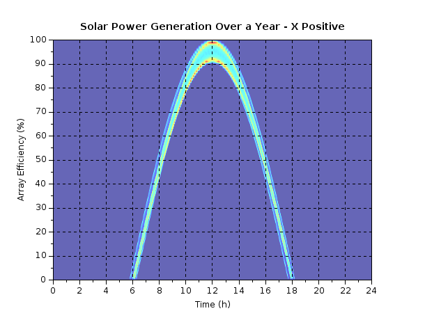
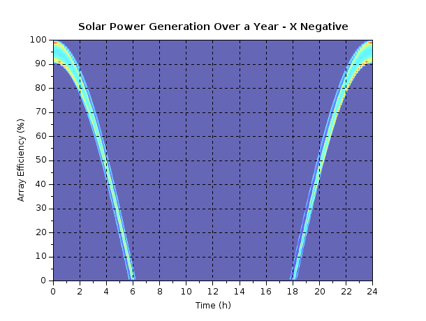
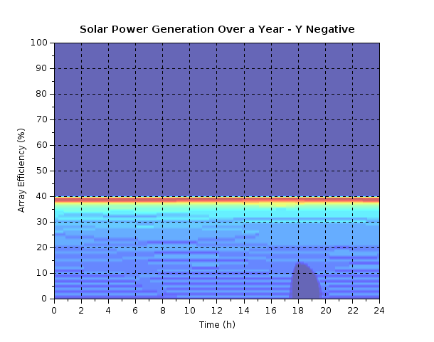
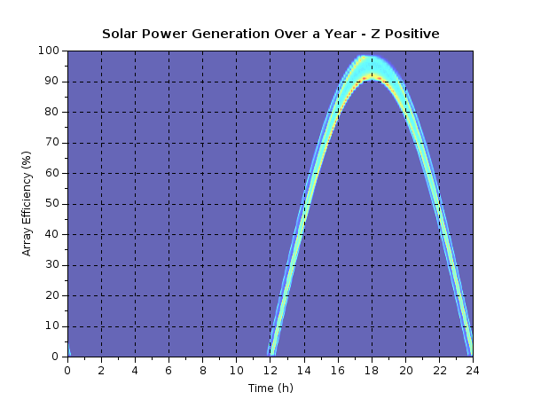
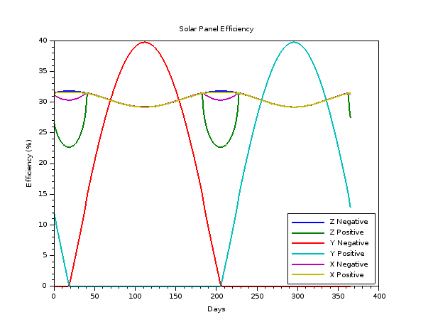
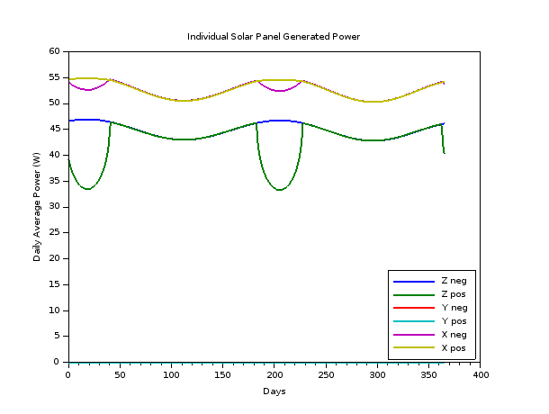
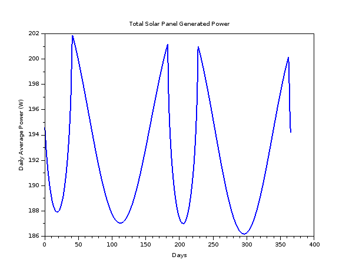
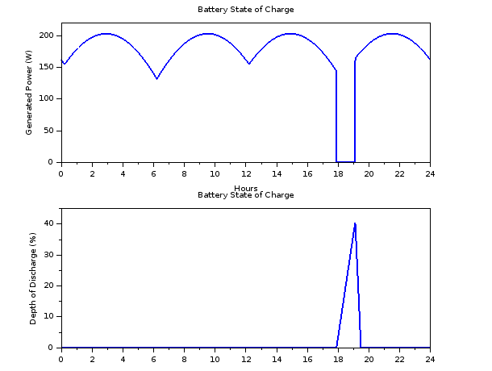
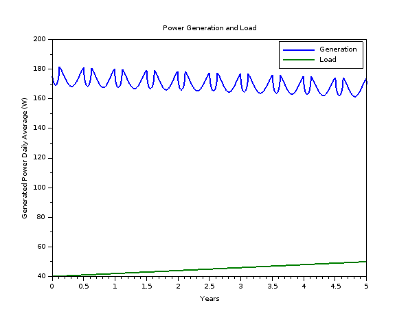
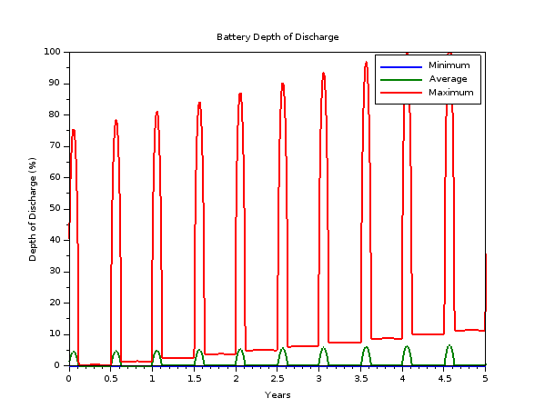

# Power Generation

Solar Panel Axes Power Generation Efficiencies
A Scilab script was created using the CelestLab orbital modelling toolbox from CNES.  The following analysis was performed for a satellite in geostationary orbit at an alitude of 35,786 km.
 
Due to the nature of a geostationary orbit similar orbital conditions will be experienced each day.  However, due to the tilt of the earths orbit the angles of the solar panels vary of the year.  To get some appreciation of this the power generated for each of the six axes was simulated over a day - the results were then combined over a year to form a heat map.
 
The coordinates are referenced to the earths intertial frame.  A negative z panel points nadir into the earths surface.  A positive x panel is aligned with the easterly tangent at the surface of the earth directly below the satellite.  Similarly a positive y panel points northward from the point on the earth intersected by the radius of the satellites orbit.
 

It can be seen that the x and z axes exhibit the typical cosine reponse over the day with some slight variation over the year.  The maximum daily power generated is 90 - 100% of the direct sunlight available.  The y axes are never pointed directly at the sun so do not ever obtain an efficiency above 40%, because the angle is tending towards orthogonal it experiences less daily variation but greater yearly variation.  Finally the effect of eclipses which are experienced for part of the year can be seen at the 18 hour mark on the affected panels with less intensity.
 
The same data shown above has been condensed where the average power generated each day on each axis is plotted over the year.  Here the effect of eclipse can be clearly seen on the affected axes.  The y axes are heavily affected by the tilt of the earth with whole six month periods where no power is generated.
 

 
## Solar Panel Configuration Power Generation Modelling

To model the power generated with a realistic solar panel configuration the script used the following parameters:
 - SpectroLab XTJ Prime Cells
 - X Positive - Double deployed 6U panel plus 3U body panel, 47 cells in total
 - X Negative - Double deployed 6U panel plus 3U body panel, 47 cells in total
 - Y Positive - No cells
 - Y Negative - No cells
 - Z Positive - Double deployed 6U panels, 40 cells in total
 - Z Negative - Double deployed 6U panels, 40 cells in total

The effect of radiation was also included in the simulation by linearly interpolating the 5 years in GEO degradation value provided by Spectrolab.
 
Here the average powered generated per day day is plotted for each panel:

 
The total power average power generated by the configuration each day is plotted below.  Note the slight loss of power generation over the year due to radiation effects.

 
# Power Management

Here energy storage and loads will be added to the power generation above to get a feel for a representative power balance.

## Power Balance Simulation

To perform the power balance simulation the following parameters were used:
 - The same panel configuration as above: 47 cells +/- x axis, 0 cells +/- y axis, 40 cells +/- axis
 - 120 Watt hour battery
 - 40 Watt continual satellite power load
The continual 40 W load is not very accurate but gives a starting point.
 
The following non-idealities in the system are modelled:
 - Solar cell efficiency degradation due to radiation induced displacement damage - updated per day
 - Solar array regulator efficiency at 90% - static
 - Battery cell degradation due to charge/discharge cycle - updated per 30 seconds
 - Load power increase due to TID induced leakage - updated per day

The impact of the thermal enviroment is not modelled which can have a large impact on solar cell and battery performance.  This can be added later once a thermal model is developed.

## Single Day Power Performance

To start, a single days power generation, storage and distribution is modelled.

It can be seen that this scenario is modelled at a time of year when an eclipse occurs.  The satellite maintains net positive power for almost all of the day where the battery is fully charged - 0% depth of discharge.  As the satellite enters eclipse power generation stops and the 40 W load is drawn directly from the battery for the hour and a half eclipse period.  This leads to significant depth of discharge - 40%.  Following the eclipse the battery is recharged quickly due to the large power surplus.
 
## Five Year Power Performance

To investigate the performance of the power system over the lifetime of the satellite longer time periods are considerd.  Here simulations are performed over five years, the simulation is updated every 30 seconds but the data is reduced to one day snapshots, usually by averaging if not specified otherwise.
 
The power generated and load on the system progresses over the five year period as seen below:

Here it can be seen that the radiation reduces the power generated while simultaneously increasing the load power.  In this configuration it is clear that there is a massive power surplus is and less solar panels could be used or larger loads could be supported.
 
The battery depth of discharge is considered next where the minimum, average and maximum discharge over each day is plotted.
 

It can be seen that everytime an eclipse occurs the daily minumum discharge is considerable.  The extent of the daily discharge increases due to the increased load power due to radiation and the decreasing battery capacity due to discharge cycling.  It can be seen that in the current configuration the satellites power budget is violated after 4.5 years and the undervoltage protection would kick in.
 
The battery capacity over the period is presented here:

Everytime an eclipse period is entered there is considerable battery charging and discharging action which drops the capacity of the battery.  During the rest of the year the capacity does not drop as the battery is maintained at maximum charge.  Any loss of battery capacity due to static ageing is not considered in this model.
 
 
